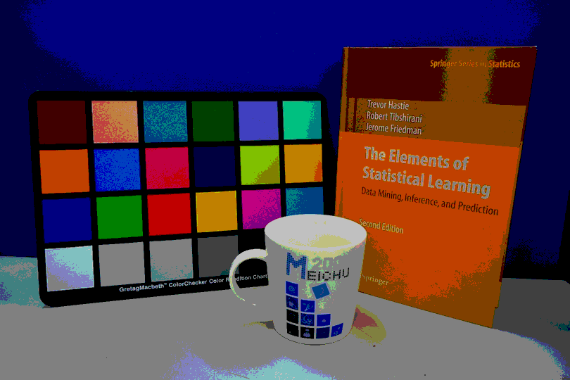
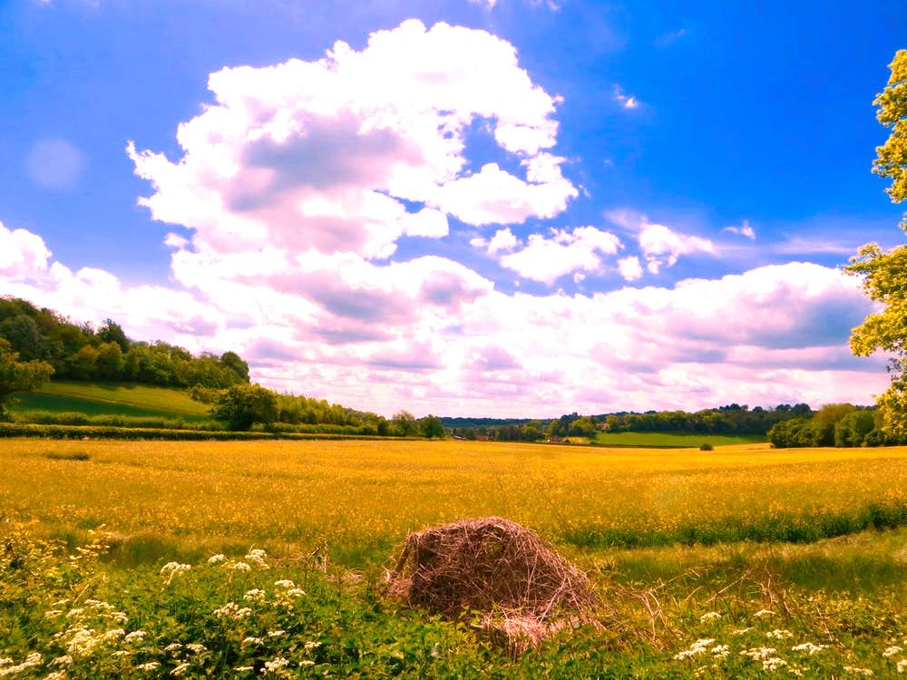
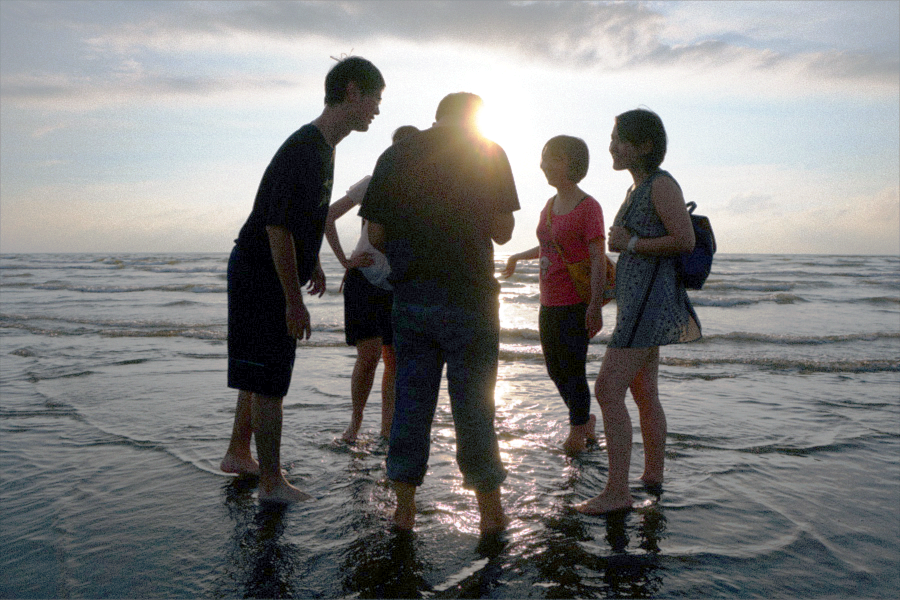
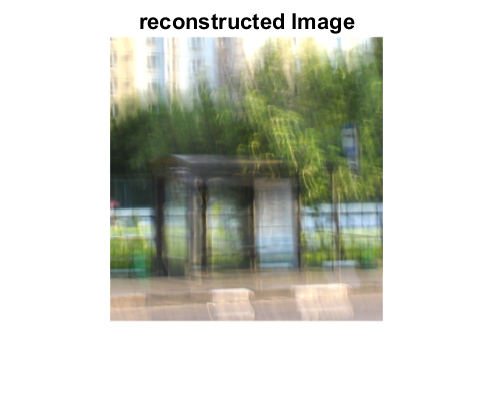
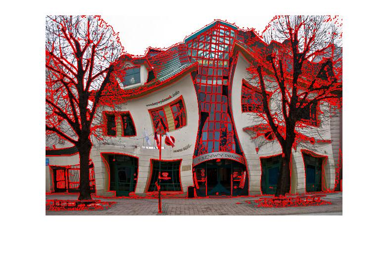

# Digital-Image-Processing
## HW1--Image read/write, scaling, quantization in C++
The Example of Quantization

## HW2--White Balance & Color Transformation in MATLAB
The Example of Color Transformation 

## HW3--Image Enhancement

## HW4--Image Restoration

## HW5--Image Segmentation

